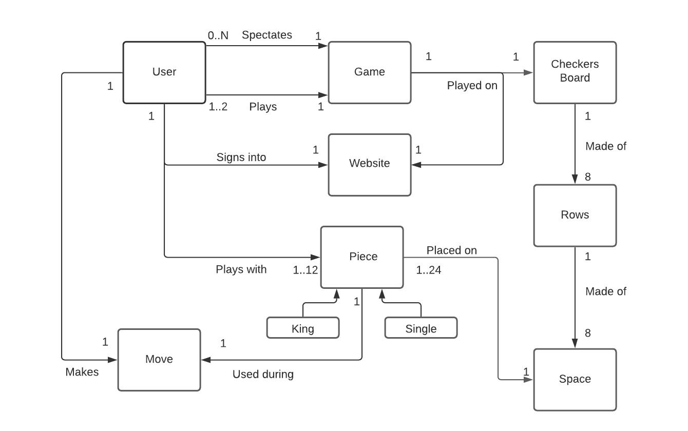
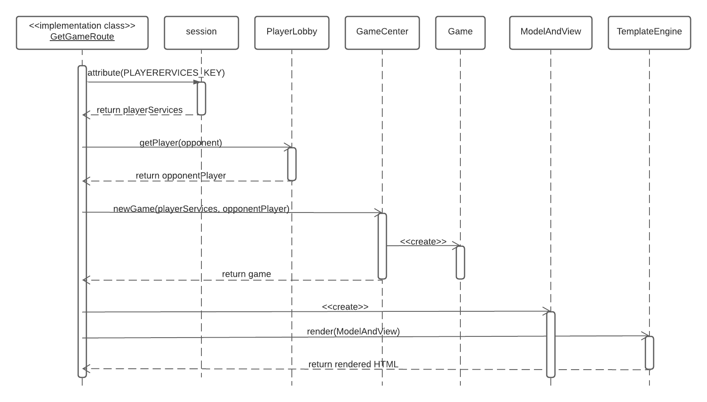
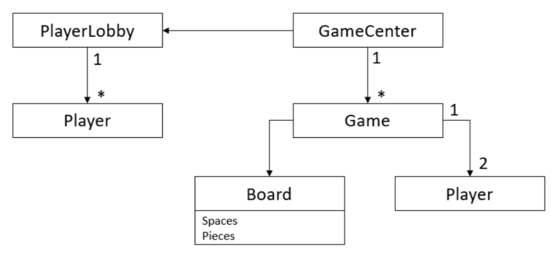
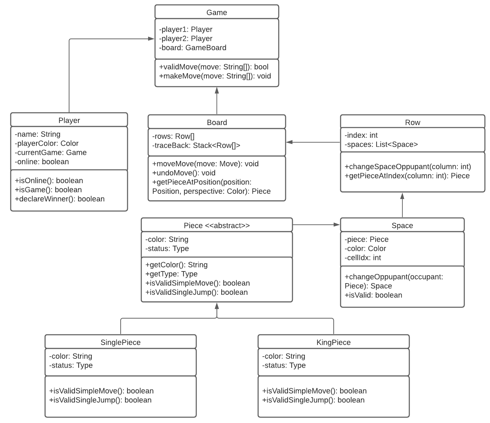
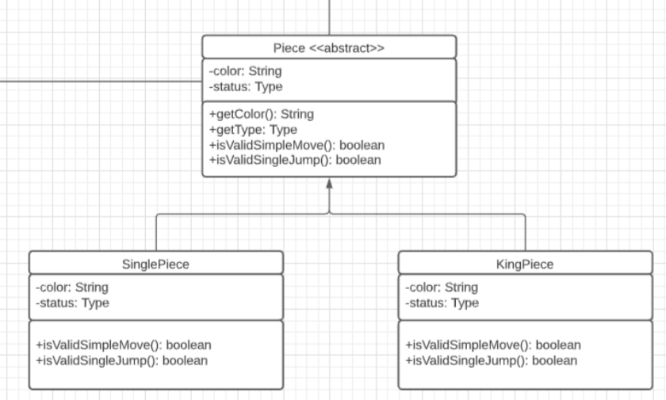
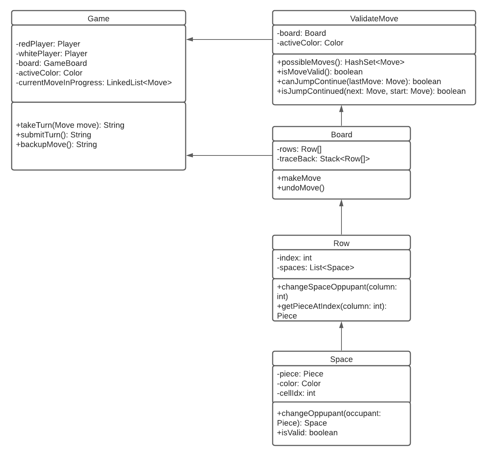

# PROJECT Design Documentation

## Team Information
* Team name: CDI
* Team members
  * Jack Irish (jti2576@rit.edu)
  * Hana Ho (hth2539@rit.edu)
  * Matthew Simoni (mss9774@rit.edu)
  * Nicholas Deary (njd5368@rit.edu)

## Executive Summary

This project allows the users to engage with others and test their skills in a game of online checkers.

### Purpose

The purpose of this project is to allow users to play online checkers.

### Glossary and Acronyms

| Term | Definition |
|------|------------|
| King Row | The last row opposite of the player |
| VO | Value Object |

## Requirements

This section describes the MVP features of the application.

* The player can sign in and sign out.
* The player can start a game.
* The player can follow through and finish the game.
* The game follows the american rules.
* The player can resign and leave the game.

### Definition of MVP
The MVP for this project is to provide a way for users to sign in using a username and play
a game of checkers based on the American rules against an opponent of their choice. They should
also be able to resign from a game and sign out when finished playing a game. 

### MVP Features
Every player must sign-in before being able to do anything.
Every player must be able to sign out.
Two players must be able to play a game of checkers based upon the American rules.
Either player of a game may choose to resign, at any point, which ends the game.

### Roadmap of Enhancements
1. Spectator: Users can click and view another players game. This allows them to see the game without giving them access
to change the board.

## Application Domain

This section describes the application domain.

Two users or one user and the AI can play a game. The game is played on a board made of squares. The users and AI
then take turns moving their pieces and capturing their opponent's pieces until one player captures all of his or her
opponents pieces.

## Architecture and Design

This section describes the application architecture.

### Summary

The following Tiers/Layers model shows a high-level view of the webapp's architecture.

As a web application, the user interacts with the system using a
browser.  The client-side of the UI is composed of HTML pages with
some minimal CSS for styling the page.  There is also some JavaScript
that has been provided to the team by the architect.

The server-side tiers include the UI Tier that is composed of UI Controllers and Views.
Controllers are built using the Spark framework and View are built using the FreeMarker framework.  
The Application and Model tiers are built using plain-old Java objects (POJOs).

Details of the components within these tiers are supplied below.

### Overview of User Interface

This section describes the web interface flow; this is how the user views and interacts
with the WebCheckers application.

If the user has not signed in, they will see a home page with the number of players online, and a sign-in 
in button. The sign-in button will direct them to a page where they can choose a username. If the username 
is invalid, there will be a message. After the player signs in, they will be directed to a new home page that
now displays the usernames of the players signed-in, and the option to sign out. The user has the option to 
invite another player to a game. If the user invites a player, they will be the red player. If they are invited 
by another player, they will be the white player. 

### UI Tier

The UI tier focuses on the front end of the code and handles the user interaction with the website. The user starts with
the 'GET /' which generates the home page. However, they would find it bare with little information until the user hits the 
sign-in button, which uses the 'Get /SignIn' route to redirect the user to a sign-in page. After the user submits their
name, they get directed back to the home page following the 'POST /SignIn'. Now the user can select an opponent to play 
against and doing so sends the user into the game route with the 'GET /game'. Once both players are in, the user who 
started the game goes first. They can make a move which calls 'POST /validateMove' and sees if that's allowed. Once they
make this move the user can either submit the move with 'POST /submitTurn' or undo the move with 'POST /backup'. The other
player now knows it's their turn because of 'POST /checkTurn' which updates the user. Then when the user wants to resign 
they can hit the resignation button which calls 'POST /resign'. Then they can log out by 'POST /signOut'. Along with the
ability to play a game players can spectate by logging in and joining a game in progress where 'POST /spectator/checkTurn'
updates the board and 'GET /spectator/stopWatching' allows the user to exit the game.

See the user interface diagram for a visual version of these connections

### Application Tier
The application tier includes the GameCenter and PlayerLobby. When the system starts, the game center gets created
and interacts with the player lobby. The player lobby holds all the players currently signed in the checker website. 
This means it is involved in adding players to the lobby when the sign in and removing them when they sign out. 
GameCenter is involved with creating the game. It takes the players from the lobby and adds them into a game. GameCenter
lets two player enter a game and the rest as spectators. One will be the red player, and the other is the white player. 
The spectators are able to watch the game but cannot alter the board or it's pieces.

### Model Tier
The model tier is responsible for running the checkers game.

The game is played on a board made of rows. Each row has eight spaces each of which may or may not have a piece on it.
The pieces can either be single pieces or king pieces as represented in the following diagram.

King pieces can move in any direction on the board, while the single pieces can only move in the forwards direction.
The players take turns moving their pieces until all of one player's pieces are captured. At this point the game ends,
and the winner is declared by the game class.
A lot of the logic for playing a game comes from Game and ValidateMove. ValidateMove checks all the moves to make sure
that they are valid and checking for other possible moves. The relationship they have below is better shown in the 
following diagram.

### Design Improvements
The most recent design improvement we had was removing a lot of the logic from the ui and putting it into the model. It 
cause us to need to change our unit tests, and we had to modify any files that were affected. We made this decision to
lessen the amount of logic that the ui file was dealing with. 

## Testing

### Application Tier

| Element | Class % | Method % | Line % |
|---------|---------|----------|--------|
| GameCenter | 100% (1/1) | 100% (4/4) | 94% (16/17) |
| PlayerLobby | 100% (1/1) | 100% (8/8) | 100% (32/32) |

The application tier only has two classes, both of which have all their methods tested. GameCenter has a 94% line 
coverage while PlayerLobby has a 100% line coverage. 

### Model Tier

| Element | Class % | Method % | Line % |
|---------|---------|----------|--------|
| Board | 100% (1/1) | 100% (5/5) | 98% (49/50)|
| Color | 100% (1/1) | 100% (2/2) |	100% (4/4)|
| Game | 100% (1/1) | 100% (14/14) | 97% (79/81)|
| KingPiece | 100% (1/1) | 100% (3/3) | 100% (12/12)|
| Move | 100% (1/1) | 100% (9/9) | 100% (15/15)|
| Piece | 100% (2/2) | 100% (5/5) | 100% (8/8) |
| Player | 100% (1/1) | 100% (12/12) | 100% (23/23) |
| Position | 100% (1/1) | 100% (8/8) | 100% (16/16) |
| Row | 100% (1/1) | 100% (8/8) | 100% (18/18) |
| SinglePiece | 100% (1/1) | 100% (3/3) | 100% (13/13) |
| Space | 100% (1/1) | 100% (8/8) | 100% (14/14) |
| ValidateMove | 100% (1/1) | 100% (9/9) | 98% (102/104) |

In the model tier, all the classes and methods have been tested. The line coverage for each individual class is over 95%.

### UI Tier

| Element | Class % | Method % | Line % |
|---------|---------|----------|--------|
| GetGameRoute | 100% (1/1) | 100% (3/3) | 100% (51/51) |
| GetHomeRoute | 100% (1/1) | 100% (3/3) | 100% (32/32) |
| GetSignInRoute | 100% (1/1) | 100% (3/3) | 100% (9/9) |
| GetSpectatorStopWatchingRoute | 100% (1/1) | 100% (2/2) |	100% (18/18)|
| PostBackupMoveRoute| 100% (1/1) | 100% (2/2) | 100% (12/12) |
| PostCheckTurnRoute| 100% (1/1) | 100% (2/2) |	100% (14/14) |
| PostResignGameRoute| 100% (1/1) | 100% (3/3) |	100% (18/18) |
| PostSignInRoute| 100% (1/1) | 100% (3/3) | 96% (27/28) |
| PostSignOutRoute| 100% (1/1) | 100% (3/3) | 100% (14/14) |
| PostSpectatorCheckTurnRoute |	100% (1/1) | 100% (2/2) | 100% (16/16) |
| PostSubmitTurnRoute |	100% (1/1)|	100% (2/2) | 100% (12/12) |
| PostValidateMoveRoute | 100% (1/1) | 100% (2/2) | 100% (15/15) |
| WebServer | 0% (0/1) | 0% (0/3) | 0% (0/24) |

In the UI tier, the only class not at 100% line coverage is the PostSignInRoute class. This is because the untested line
of code is a return statement after a halt statement. The return is necessary for the code to compile, but it is 
impossible to reach. WebServer is not necessary to test. All other classes, methods, and lines are tested.

### Util Tier

| Element | Class % | Method % | Line % |
|---------|---------|----------|--------|
| CurrentUser | 100% (1/1) | 100% (2/2) | 100% (4/4) |
| Message | 100% (2/2) | 100% (10/10) | 100% (14/14) |

All classes, methods, and lines are tested.

### Acceptance Testing

9 User Stories have their acceptance criteria completed.
0 User Stories have falling acceptance criteria completed.
0 User Stories have no testing at all yet.

No issues to report yet with acceptance criteria

### Unit Testing and Code Coverage

Our unit testing strategy is to cover at least 95% of lines per class. Whenever necessary, Mockito was used to mock
classes when tests required it. The model and application tests cover more than 90%. Currently, the ui tests cover just 
about 90% of lines due to the fact that WebServer doesn't have tests.

### Code Metrics

####Complexity Metrics:

#####Methods:

| Method | Cognitive Complexity| 
|--------|---------------------|
|Game.takeTurn(Move) | 23 |
|BoardTest.checkeredPattern()| 20 |
|ValidateMove.kingJumpMove(position) | 20 |

Cognitive complexity is how difficult it is to read the methods. The BoardTest is complex due to the desire to not have
backdoors in our code that added unneeded complexity. So a game needed to be simulated for checking. The take turn method
relies on a lot of return cases to inform the player what has happened and what to do from that point onward. This likely 
cannot be solved easily. Finally, king jump move could be reduced by using single jump move to alleviate the length issue 
a bit but this doesn't help much with making the rest readable. There is just a need to look through a lot to validate a
king jump.

| Method | Essential Cyclomatic Complexity | 
|--------|---------------------------------|
|Game.takeTurn(Move) | 7 |
|PlayerLobby.addPlayer(String) | 5 |
|GameCenter.newGame(Player, Player) | 4 |
|GetGameRoute.handle(Request, Response) | 4 |

Essential cyclomatic complexity tells how much complexity is left once well-structured 
complexities are removed. TakeTurn needs to check for multiple errors and these vary by slight differences that are dependant on
if statements that return information. addPlayer is the same as an invalid name returns an error. New game also breaks based
on different scenarios that determine what game needs to be returned. Finally, GetGameRoute also needs to break based on
different stages of the game and will redirect accordingly. 

| Method | Design Complexity | 
|--------|-------------------|
|ValidateMove.kingJumpMove(position) | 21 |
|ValidateMove.singleJumpMove(position) |11 |
|BoardTest.checkeredPattern() | 10 |
|ValidateMove.kingSimpleMove(position) | 9 |

Design complexities the complexity of the design-reduced module and reflects the complexity of the module's calling 
patterns to its immediate subordinate modules. kingJumpMove, kingSingleMove and singleJumpMove both have the issue with 
needing to know the board around them for every piece, so it gets complicated fast. It could be possible to ask the piece 
to verify itself what it's surrounding looks like. The checkeredPattern just needs to recreate a board and by doing so 
makes calls unfitting to its size. Some code that implements backdoors could help reduce the issue. 

| Method | Cyclomatic Complexity |
|--------|-----------------------|
|ValidateMove.kingJumpMove(position) | 21 |
|ValidateMove.singleJumpMove(position) | 11 |

Cyclomatic complexity is a count of the linearly independent paths through source code. You can also think of this more 
simply as "the number of decisions a given block of code needs to make". The two issues mentioned above revolve around the 
branching needed to validate jump moves which can be complicated as the jumps can include multi-jumps.

######Classes

| Class | Average Operation Complexity | 
|-------|------------------------------|
|ValidateMove | 4.11 |
|Board | 3.80 |
|GetGameRoute | 3.50 |

Average operation complexity time to complete the operations in the classes. It can be used to determine how complex the
methods in the class are compared to how many are located in the class. For ValidateMove the checking of the moves causes
the methods to take a longer time as they have to view all available moves. It could be possible to check each piece based on
movement. But, this way allows to check if other moves are options. Board could be reduced but the thinking of what board 
should contain was based on it being connected to many parts. GetGameRoute could refer to a helper class but, game just 
need to alot of redirecting that isn't complicated but in one method.

| Class | Weighted Method Complexity |
|--------|----------------------------|
|ValidateMoveTest | 42 |
|ValidateMove | 37 |
|Game | 32 |

Weighted method complexity is the number of methods and their complexity. It is a predictor of how much time and effort 
is required to develop and maintain the class. ValidateMoveTest is terrible in this metric because it plays out many
game scenarios to test ValidateMove. ValidateMove and Game are also pretty high because they contain most of the logic
for the model. We decided that these are acceptable.

####Chidamber-Kemerer Metrics:
No issues found based on these metrics.

#####Javadoc Coverage Metrics:
No issues found based on these metrics.

#####Lines of Code Metrics:
No issues found based on these metrics.

#####Martin Package Metrics:
No issues found based on these metrics.

### Recommendations Going Forward

* A decline game feature would be helpful, so the user does not get put into a game they do not want to play.
* A more obvious sign in button on the home page. 
* A rules button with a pop up text of the rules in the game view.
* An AI option for the user. Most of the logic is in the possibleMoves method in ValidateMove.
* A help button where the user can get help from the server if they are stuck. Similar to AI, most of the logic is in 
  the possibleMoves method in ValidateMove.

